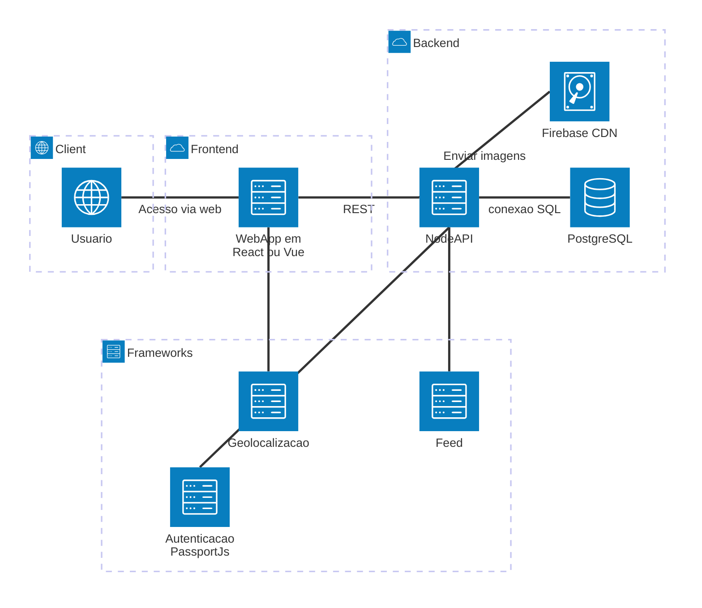

# OndeTa?

Aplicação colaborativa para localização de animais perdidos com feed interativo e geolocalização.


# Tecnologias

## Back-end  
Python (vamos tentar esse primeiro), Node.js ou  Express / Fastify / NestJS

## Front-end (a definir)
React, Vue,  Angular ou SvelteKit

## Banco de dados
PostgreSQL

## Acesso ao banco
pg (node-postgres) e Prisma ORM


# Arquitetura do projeto

Combinação de MVC (Model-View-Controller) com Arquitetura em camadas (Layered architecture)



#  Estrutura do projeto (a definir)

## Root

```text
lost-pets-app/
├── frontend/
├── backend/
├── docs/
├── README.md
```

## Front-end

```text
frontend/
├── public/
├── src/
│   ├── models/         → Estrutura de dados
│   ├── views/          → Interface (UI)
│   │   ├── pages/
│   │   ├── components/
│   │   └── layouts/
│   ├── controllers/    → Lógica da interface
│   ├── services/       → Comunicação com API
│   ├── routes/         → Rotas REST para comunicação com BE
│   ├── utils/          → Métodos auxiliares
│   ├── styles/         → Estilo das páginas
│   ├── App.jsx         → TODO: A definir a framework (React, Vue, etc..)
│   └── main.jsx        → TODO: A definir a framework (React, Vue, etc..)
├── package.json        → Orquestrar dependências (Bibliotecas externas)
└── .env.example        → Configuração de ambientes
```

## Back-end

```text
backend/
├── src/
│   ├── models/             → Entidades do sistema
│   ├── controllers/        → Recebe requisições
│   ├── routes/             → Define endpoints
│   ├── services/           → Regras de negócio
│   ├── repositories/       → Acesso ao banco
│   ├── middlewares/        → Autenticação, erros, etc.
│   ├── validations/        → Validar dados antes do processamento.
│   ├── utils/              → Métodos auxiliares
│   ├── config/             → URLs do banco de dados, portas e servidores
│   ├── app.js
│   └── server.js
├── package.json            → Orquestrar dependências (Bibliotecas externas)
└── .env.example            → Configuração de ambientes
```


# Convenções de código

## Idioma
```text
* Código: inglês
* Documentação: português
```
   
## Nomes de variáveis
```text
camelCase
```

## Nomes de classes
```text
PascalCase
```

## Nomes de funções
```text 
PascalCase

* Verbos no infinitivo
* Podemos expandir o exemplo para adicionar template de comentários
```

## Componentes React
```text
PascalCase
```

## Banco de dados
```text
snake_case
```

## Padrão de API REST
```text
Regras: 

* Usar substantivos (não verbos)
* Plural
* Status HTTP correto

GET    /pets
GET    /pets/:id
POST   /pets
PUT    /pets/:id
DELETE /pets/:id
```

## Padrão de commits
```text
feat: adicionando endpoint de cadastro de pets
fix: corrigindo validação de login
docs: atualizando README
refactor: melhorando estrutura da camada service
style: ajustando o componente name
```

## Padrão de pull request e merge
```text
Usar a opção "Squash and merge"
```
</br>

# 🚨 Regras gerais do projeto 

### 1. Seguir padrão REST nas APIs

### 2. Não misturar responsabilidades entre camadas

### 3. Não criar pastas genéricas (ex: "outros", "coisas")

### 4. Cada arquivo deve ter uma única responsabilidade

### 5. Manter no máximo de ~50 linhas por função

### 6. Evitar funções com múltiplas responsabilidades

### 7. Reutilizar código sempre que possível

### 8. Nunca colocar senha direto no código

### 9. Usar variáveis de ambiente (`.env`)
```python
import os

password = os.getenv("DB_PASSWORD")
```

### 10. Conexão com Banco
* Centralizar conexão em um único arquivo
* Nunca repetir código de conexão
```python
def get_connection():
    return psycopg2.connect(...)
```

### 11. Validar dados antes de salvar no Banco
```python
if animal not in ["gato", "cachorro"]:
    raise ValueError("Animal inválido")
```

### 12. Seguir CRUD padrão
* Cada entidade deve ter: `criar()`, `listar()`,  `atualizar()` e `deletar()`

### 13. Sempre tratar exceções
```python
try:
    inserir(...)
except Exception as e:
    print("Erro:", e)
```

### 14. Gerenciar dependências com `requirements.txt`
```bash
pip freeze > requirements.txt
```
 

# Como executar
## Backend
```bash
cd backend
npm install
npm run dev
```
## Frontend
```bash
cd frontend
npm install
npm run dev
```

# Como instalar, configurar e utilizar o PostgreSQL 
## 1. Instalação
### Linux (Ubuntu/Debian)
```bash
sudo apt update
sudo apt install postgresql postgresql-contrib
```
### Windows
```text
Baixe pelo site oficial:
https://www.postgresql.org/download/
```

## 2. Iniciar o serviço
```bash
sudo systemctl start postgresql
```

## 3. Acessar o PostgreSQL
```bash
sudo -u postgres psql
```

## 4. Criar banco de dados
```sql
CREATE DATABASE ondeta_db;
```

## 5. Criar usuário
```sql
CREATE USER adminondeta WITH PASSWORD 'admin';
```

## 6. Conectar ao banco
```sql
\c ondeta_db
```

## 7. Criar tabela
```sql
CREATE TABLE animais_perdidos (
    id SERIAL PRIMARY KEY,
    login VARCHAR(50) NOT NULL,
    animal VARCHAR(10) NOT NULL,
    local VARCHAR(100) NOT NULL
);
```

## 8. Configurar permissões
Dar acesso completo ao usuário:
```sql
GRANT ALL PRIVILEGES ON DATABASE ondeta_db TO adminondeta;
GRANT ALL ON SCHEMA public TO adminondeta;
GRANT ALL PRIVILEGES ON ALL TABLES IN SCHEMA public TO adminondeta;
```

Garantir permissões futuras:
```sql
ALTER DEFAULT PRIVILEGES IN SCHEMA public
GRANT ALL ON TABLES TO adminondeta;
```

Garantir acesso às sequências (IMPORTANTE para INSERT):
```sql
GRANT ALL PRIVILEGES ON ALL SEQUENCES IN SCHEMA public TO adminondeta;
```

## 9. Tornar o usuário dono da tabela (opcional)
```sql
ALTER TABLE animais_perdidos OWNER TO adminondeta;
```

## 10. Testar o banco
```sql
INSERT INTO animais_perdidos (login, animal, local)
VALUES ('teste', 'gato', 'Maringá');

SELECT * FROM animais_perdidos;
```

## 11. Conexão no Python
Certifique-se de instalar a dependência:
```bash
pip install psycopg2-binary
```
Exemplo de conexão:
```python
import psycopg2

conn = psycopg2.connect(
    host="localhost",
    database="ondeta_db",
    user="adminondeta",
    password="admin",
)
```

**Banco padrão do projeto**

* Database: `ondeta_db`
* Usuário: `adminondeta`
* Senha: `admin`
</details>

**Versão:** 1.2
**Atualizado em:** 11/4/2026

