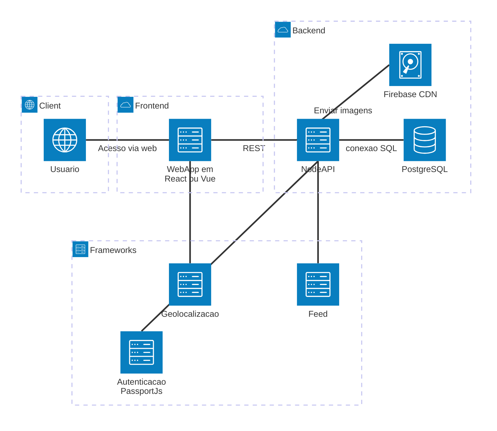

# OndeTa

Aplicação colaborativa para localização de animais perdidos com feed interativo e geolocalização.


# 📌 Objetivo

Permitir que usuários:

* Cadastrem animais perdidos/encontrados
* Publiquem avistamentos
* Interajam via comentários
* Busquem animais por localização
* Visualizem informações em um feed interativo

<br>

# 🧱 Arquitetura do projeto

O sistema segue uma combinação de:

* **MVC (Model-View-Controller)**
* **Arquitetura em Camadas (Layered Architecture)**




# 🛠️ Tecnologias

## Front-end (a definir)

Sugestões compatíveis com REST:

* React
* Vue
* Angular
* SvelteKit

## Back-end

* Node.js
* Express / Fastify / NestJS

## Banco de dados

* PostgreSQL

## Acesso ao banco

* pg (node-postgres)
* Prisma ORM


<br>


# 📁 Estrutura do projeto

## 📦 Root

```text
lost-pets-app/
├── frontend/
├── backend/
├── docs/
├── README.md
```


<br>


## 🎨 Front-end

```text
frontend/
├── public/
├── src/
│   ├── models/         → Estrutura de dados
│   ├── views/          → Interface (UI)
│   │   ├── pages/
│   │   ├── components/
│   │   └── layouts/
│   ├── controllers/    → Lógica da interface
│   ├── services/       → Comunicação com API
│   ├── routes/         → Rotas REST para comunicação com BE
│   ├── utils/          → Métodos auxiliares
│   ├── styles/         → Estilo das páginas
│   ├── App.jsx         → TODO: A definir a framework (React, Vue, etc..)
│   └── main.jsx        → TODO: A definir a framework (React, Vue, etc..)
├── package.json        → Orquestrar dependências (Bibliotecas externas)
└── .env.example        → Configuração de ambientes
```

## ⚙️ Back-end

```text
backend/
├── src/
│   ├── models/             → Entidades do sistema
│   ├── controllers/        → Recebe requisições
│   ├── routes/             → Define endpoints
│   ├── services/           → Regras de negócio
│   ├── repositories/       → Acesso ao banco
│   ├── middlewares/        → Autenticação, erros, etc.
│   ├── validations/        → Validar dados antes do processamento.
│   ├── utils/              → Métodos auxiliares
│   ├── config/             → URLs do banco de dados, portas e servidores
│   ├── app.js
│   └── server.js
├── package.json            → Orquestrar dependências (Bibliotecas externas)
└── .env.example            → Configuração de ambientes
```

# 📏 Convenções de código

## 🧾 Idioma

* Código: **inglês**
* Documentação: Português


<br>


## 🔤 Nomes de variáveis

### camelCase

```js
const petName = "Rex";
const userLocation = {};
const isLost = true;
```


<br>


## 🧩 Componentes React

### PascalCase

```jsx
function PetCard() {}
function FeedPage() {}
```


<br>


## 📦 Arquivos

| Tipo         | Padrão           |
| ------------ | ---------------- |
| Controllers  | petController.js |
| Services     | petService.js    |
| Repositories | petRepository.js |
| Components   | PetCard.jsx      |
| Pages        | FeedPage.jsx     |


<br>


## 🗄️ Banco de dados

### snake_case

```sql
pet_name
created_at
user_id
last_seen_location
```


<br>


# 🌐 Padrão de API REST

## Endpoints

```http
GET    /pets
GET    /pets/:id
POST   /pets
PUT    /pets/:id
DELETE /pets/:id
```

## Regras

* usar substantivos (não verbos)
* plural
* status HTTP correto


<br>

# 📝 Padrão de commits

```text
feat: adicionando endpoint de cadastro de pets
fix: corrigindo validação de login
docs: atualizando README
refactor: melhorando estrutura da camada service
style: ajustando o componente name
```

# 📝 Padrão de pull request e merge
```text
Usar a opção "Squash and merge"
```

<br>

# ⚠️ Regras do projeto

1. Todo código deve estar em inglês
2. Usar camelCase para variáveis e funções
3. Usar PascalCase para componentes
4. Usar snake_case no banco
5. Seguir padrão REST nas APIs
6. Não misturar responsabilidades entre camadas
7. Não criar pastas genéricas (ex: "outros", "coisas")
8. Cada arquivo deve ter uma única responsabilidade

<br>

# ▶️ Como executar

## Backend

```bash
cd backend
npm install
npm run dev
```

<br>

## Frontend

```bash
cd frontend
npm install
npm run dev
```

