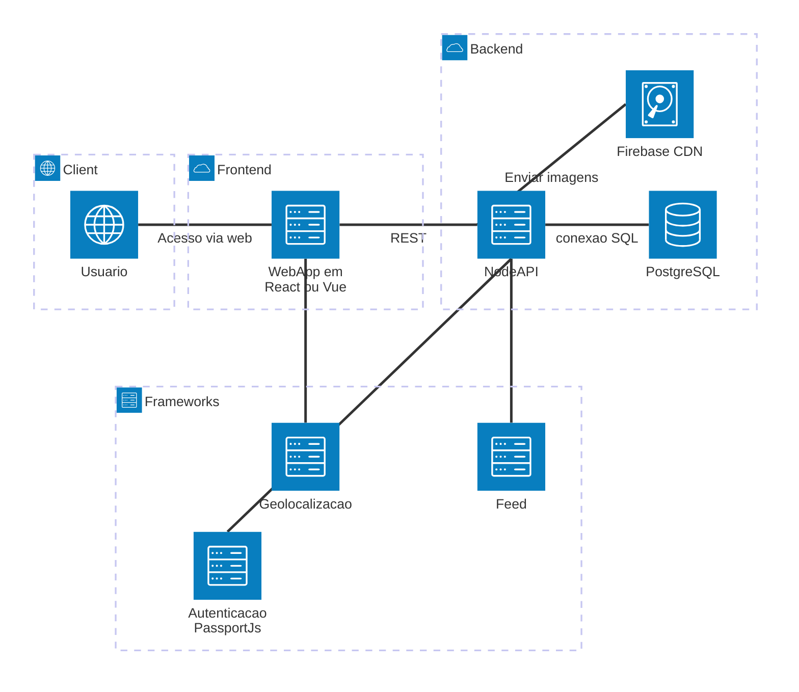

# OndeTa
Aplicação colaborativa para localização de animais perdidos com feed interativo e geolocalização.

<hr style="height:10px;border-width:0;color:gray;background-color:gray">

<details>
<summary>Lista de TODO</summary>

## Lista de TODO:
- Fazer seção sobre dependências, com pip freeze, etc; Remover outras seções que falam sobre dependências:
  - postgresql tópico 11
- Funcionalidades:
  - Cadastrem animais perdidos/encontrados
  - Publiquem avistamentos
  - Interajam via comentários 
  - Busquem animais por localização
  - Visualizem informações em um feed interativo
- Migrar tudo para a linguagem escolhida
- Ver OverLeaf ou alternativas

</details>

---

## Tecnologias

### Front-end (a definir)

Sugestões compatíveis com REST:

* **React**
* Vue
* Angular
* SvelteKit

### Back-end

* **Python** (vamos tentar esse primeiro)
* Node.js
* Express / Fastify / NestJS

### Banco de dados

* **PostgreSQL**

### Acesso ao banco

* pg (node-postgres)
* Prisma ORM

---

<details>
<summary>Configuração do Banco de Dados (PostgreSQL)</summary>

## Configuração do Banco de Dados (PostgreSQL)

Esta seção descreve como instalar, configurar e utilizar o banco de dados PostgreSQL no projeto **OndeTa** de forma local.

---

## 1. Instalação

### Linux (Ubuntu/Debian)

```bash
sudo apt update
sudo apt install postgresql postgresql-contrib
```

### Windows

Baixe pelo site oficial:
https://www.postgresql.org/download/
---

## 2. Iniciar o serviço

```bash
sudo systemctl start postgresql
```

---

## 3. Acessar o PostgreSQL

```bash
sudo -u postgres psql
```

---

## 4. Criar banco de dados

```sql
CREATE DATABASE ondeta_db;
```

---

## 5. Criar usuário

```sql
CREATE USER adminondeta WITH PASSWORD 'admin';
```

---

## 6. Conectar ao banco

```sql
\c ondeta_db
```

---

## 7. Criar tabela

```sql
CREATE TABLE animais_perdidos (
    id SERIAL PRIMARY KEY,
    login VARCHAR(50) NOT NULL,
    animal VARCHAR(10) NOT NULL,
    local VARCHAR(100) NOT NULL
);
```

---

## 8. Configurar permissões

Dar acesso completo ao usuário:

```sql
GRANT ALL PRIVILEGES ON DATABASE ondeta_db TO adminondeta;
GRANT ALL ON SCHEMA public TO adminondeta;
GRANT ALL PRIVILEGES ON ALL TABLES IN SCHEMA public TO adminondeta;
```

Garantir permissões futuras:

```sql
ALTER DEFAULT PRIVILEGES IN SCHEMA public
GRANT ALL ON TABLES TO adminondeta;
```

Garantir acesso às sequências (IMPORTANTE para INSERT):

```sql
GRANT ALL PRIVILEGES ON ALL SEQUENCES IN SCHEMA public TO adminondeta;
```

---

## 9. (Opcional) Tornar o usuário dono da tabela

```sql
ALTER TABLE animais_perdidos OWNER TO adminondeta;
```

---

## 10. Testar o banco

```sql
INSERT INTO animais_perdidos (login, animal, local)
VALUES ('teste', 'gato', 'Maringá');

SELECT * FROM animais_perdidos;
```

---

## 11. Conexão no Python

Certifique-se de instalar a dependência:

```bash
pip install psycopg2-binary
```

Exemplo de conexão:

```python
import psycopg2

conn = psycopg2.connect(
    host="localhost",
    database="ondeta_db",
    user="adminondeta",
    password="admin",
)
```

**Banco padrão do projeto**

* Database: `ondeta_db`
* Usuário: `adminondeta`
* Senha: `admin`
</details>

---

# Arquitetura do projeto

O sistema segue uma combinação de:

* **MVC (Model-View-Controller)**
* **Arquitetura em Camadas (Layered Architecture)**



<hr style="height:10px;border-width:0;color:gray;background-color:gray">

# Code Design System — OndeTa

Este documento define padrões de desenvolvimento para o projeto **OndeTa**, garantindo organização, legibilidade e escalabilidade do código.

---

## 1. Princípios

* **Simplicidade** → Código fácil de entender
* **Legibilidade** → Priorizar clareza sobre complexidade
* **Modularidade** → Separar responsabilidades
* **Manutenibilidade** → Facilitar alterações futuras

---

## 2. Estrutura do Projeto

Exemplo:
```
ondeta/
│
├── Testes x/
│   └── ...
│
├── backend/
│   └── ...
│
├── services/
│   └── ...
│
├── app.py
└── README.md
```

---

## 3. Padrão de Nomes

### Idioma

* Código: Inglês
* Documentação: Português

### Variáveis

* Usar o 'camelCase'

```python
loginUsuario = "user"
```

### Funções

* Usar o 'PascalCase'
* Verbos no infinitivo
* Podemos expandir o exemplo para adicionar template de comentários

```python
def InserirAnimal():
```

### Classes

* Usar o 'PascalCase'

```python
class AnimalPerdido:
```

---

### Banco de Dados

* Usar o 'snake_case'

```python
pet_name
created_at
user_id
last_seen_location
```

---

### Padrão de API REST

- Endpoints

```http
GET    /pets
GET    /pets/:id
POST   /pets
PUT    /pets/:id
DELETE /pets/:id
```

- Regras da API

* usar substantivos (não verbos)
* plural
* status HTTP correto

---

### Padrão de commits

```text
feat: adicionando endpoint de cadastro de pets
fix: corrigindo validação de login
docs: atualizando README
refactor: melhorando estrutura da camada service
style: ajustando o componente name
```

### Padrão de pull request e merge

```text
Usar a opção "Squash and merge"
```

---

## 4. Conexão com Banco

* Centralizar conexão em um único arquivo
* Nunca repetir código de conexão

```python
def get_connection():
    return psycopg2.connect(...)
```

## 5. Segurança

* Nunca colocar senha direto no código
* Usar variáveis de ambiente (`.env`)

```python
import os

password = os.getenv("DB_PASSWORD")
```

---

## 6. Validação de Dados

* Validar antes de salvar no banco

```python
if animal not in ["gato", "cachorro"]:
    raise ValueError("Animal inválido")
```

---

## 7. CRUD Padrão

Cada entidade deve ter:

* `criar()`
* `listar()`
* `atualizar()`
* `deletar()`

---

## 8. Tratamento de Erros

Sempre tratar exceções:

```python
try:
    inserir(...)
except Exception as e:
    print("Erro:", e)
```

---

## 9. Organização de Código

* Máximo de ~50 linhas por função
* Evitar funções com múltiplas responsabilidades
* Reutilizar código sempre que possível

---

## 10. Dependências

* Gerenciar com `requirements.txt`

```bash
pip freeze > requirements.txt
```

---

## 11. Evolução do Projeto

* Migrar para Node.js
* Migrar para API (Flask/FastAPI)/Rest API
* Separar backend/frontend
* Adicionar testes automatizados
* Adicionar recurso com mapa interativo
* Elaborar algoritmo de prioridades no feed

---

**Versão:** 1.0
**Atualizado em:** 2026
