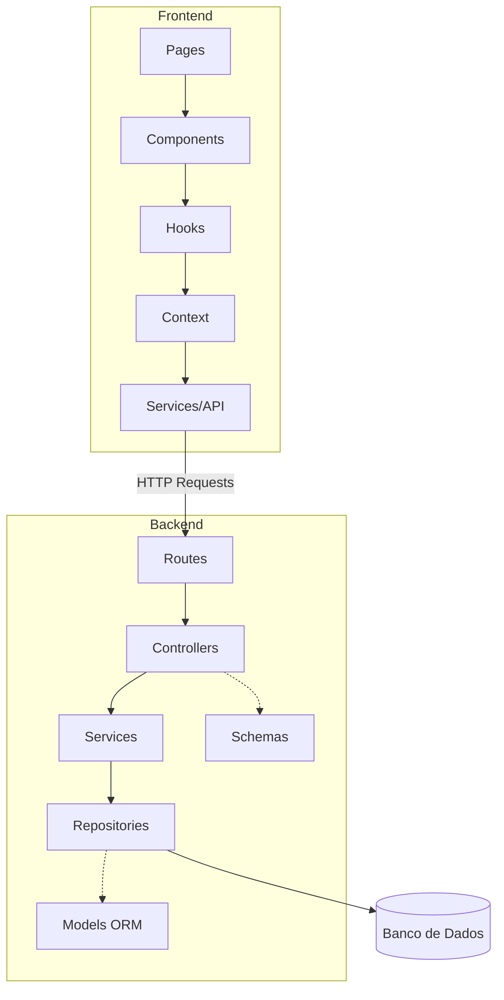

# OndeTa?  🐾 - Sistema Colaborativo de Localização de Pets

O **OndeTa?** é uma plataforma completa projetada para conectar comunidades em prol do resgate e localização de animais perdidos. Através de um feed interativo e geolocalização em tempo real, transformamos a busca por um pet em um esforço coletivo.

---

## Tecnologias e Ferramentas

### **Back-end**
* **Linguagem:** Python
* **Banco de Dados:** PostgreSQL
* **ORM:** SQLAlchemy (Acesso a dados)
* **Validação e Serialização::** Marshmallow

### **Front-end (Web)**
* **Framework:** React + Vite
* **Estilização:** CSS Modules
* **Estado Global:** Context API

---

## Arquitetura do Sistema

O projeto utiliza uma arquitetura **Cliente-Servidor** modular e desacoplada. A comunicação entre o ecossistema de frontends (Web/Mobile) e o servidor ocorre via **API REST**.

<details><summary><strong>Diagrama da Arquitetura</strong></summary>


</details>
---

##  Estrutura do Projeto

### Root

```bash
OndeTa/
├── frontend/     # Aplicação Web (React)
├── backend/      # API REST (Python)
├── docs/         # Diagramas e documentação técnica
└── README.md
```

<details><summary><strong>Front-end (Web)</strong></summary>

```bash
frontend/
├── public/
├── src/
│   ├── assets/          # imagens, ícones
│   ├── components/      # componentes reutilizáveis
│   │   ├── Navbar/
│   │   ├── PetCard/     # exemplo de componente
│   │   │   ├── index.jsx
│   │   │   ├── styles.css
│   │   │   └── iPetCard.test.js (opcional)
│   │   ├── MapView/
│   │   └── ImageUpload/
│   │
│   ├── pages/           # páginas da aplicação
│   │   ├── Login/
│   │   ├── Register/
│   │   ├── Feed/
│   │   ├── CreatePost/
│   │   └── Profile/
│   │
│   ├── hooks/           # lógica reutilizável
│   │   ├── useAuth.js
│   │   ├── usePets.js
│   │   └── useMap.js
│   │
│   ├── context/         # estado global
│   │   └── AuthContext.jsx
│   │
│   ├── services/        # comunicação com API
│   │   └── api.js
│   │
│   ├── utils/           # helpers
│   │   ├── formatDate.js
│   │   └── geoUtils.js
│   │
│   ├── routes/          # configuração de rotas
│   │   └── AppRoutes.jsx
│   │
│   ├── App.jsx
│   └── main.jsx
│
├── package.json
└── vite.config.js (ou webpack)
```
</details>

<details><summary><strong>Back-end</strong></summary>

```bash
backend/
├── app/
│   ├── __init__.py
│   │
│   ├── routes/              # endpoints
│   │   ├── auth_routes.py
│   │   ├── pet_routes.py
│   │   └── user_routes.py
│   │
│   ├── controllers/         # interface HTTP
│   │   ├── auth_controller.py
│   │   ├── pet_controller.py
│   │   └── user_controller.py
│   │
│   ├── services/            # regras de negócio
│   │   ├── auth_service.py
│   │   ├── pet_service.py
│   │   └── image_service.py
│   │
│   ├── repositories/        # acesso ao banco
│   │   ├── user_repository.py
│   │   ├── pet_repository.py
│   │   └── image_repository.py
│   │
│   ├── models/              # ORM (SQLAlchemy)
│   │   ├── user.py
│   │   ├── pet.py
│   │   └── image.py
│   │
│   ├── schemas/             # validação (marshmallow)
│   │   ├── user_schema.py
│   │   └── pet_schema.py
│   │
│   ├── utils/
│   │   ├── security.py      # hash, JWT
│   │   └── helpers.py
│   │
│   ├── config.py
│   └── extensions.py        # db, jwt, etc
│
├── migrations/              # alembic
├── tests/
├── run.py
├── requirements.txt
└── .env
```
</details>

---

## Convenções e Boas Práticas

### **Idiomas e Nomenclaturas**
* **Código (variáveis, arquivos, pastas):** Inglês
* **Documentação e Comentários:** Português
* **Estilos:** `PascalCase` (Componentes), `snake_case` (funções/DB)

### **Padrão de Commits**
* `feat:` Nova funcionalidade ou recurso.
* `fix:` Correção de algum erro ou bug.
* `docs:` Alterações em documentações (como este README).
* `refactor:` Melhorias no código que não alteram a funcionalidade final.
* `style:` Mudanças visual/estética (CSS) ou formatação de código.

---

## Regras Gerais do Projeto 

1. **Padrão REST:** Utilizar substantivos no plural e os métodos HTTP corretos (`GET`, `POST`, `PUT`, `DELETE`).
2. **Responsabilidade Única (SRP):** Cada arquivo, classe ou função deve ser responsável por apenas uma funcionalidade.
3. **Segurança:** O arquivo `.env` contém credenciais sensíveis e **nunca** deve ser enviado ao repositório (verifique o `.gitignore`).
4. **Tratamento de Erros:** 
   * No **Backend**: Utilizar blocos `try/except` para capturar exceções e retornar status codes apropriados.
   * No **Frontend**: Validar os retornos da API e exibir mensagens amigáveis ao usuário.

---

## Como Executar

### **Backend**
```bash
# Entre na pasta do backend
cd backend

# Instale as dependências
pip install -r requirements.txt

# Execute a aplicação
python run.py
```
### **Frontend**
```bash
# Entre na pasta do frontend
cd frontend

# Instale as dependências (necessário apenas na primeira vez)
npm install

# Inicie o servidor de desenvolvimento
npm run dev
```

---

**Versão:** 2.0
**Última atualização:** 6/5/2026