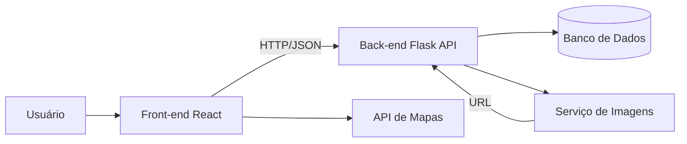
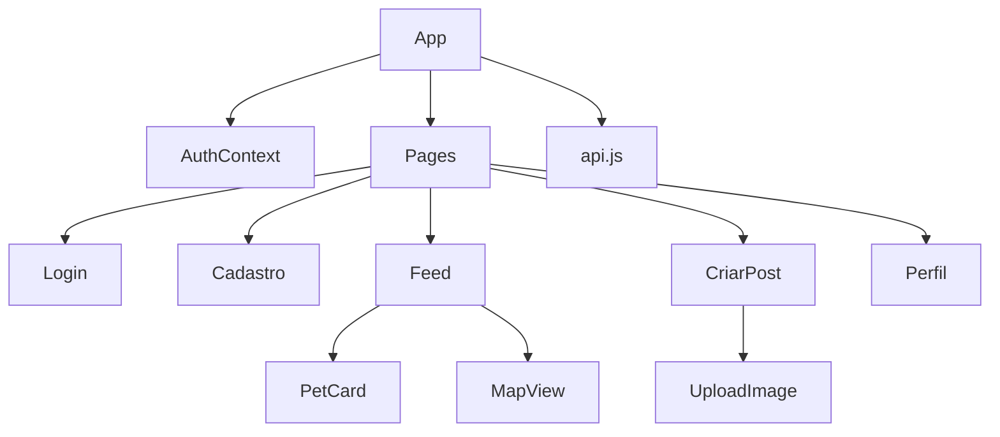
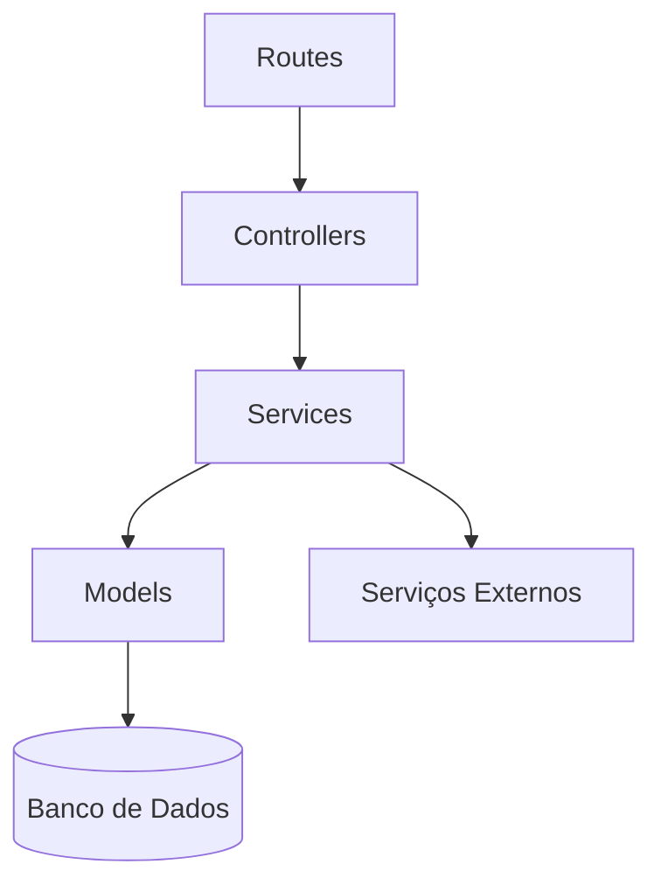
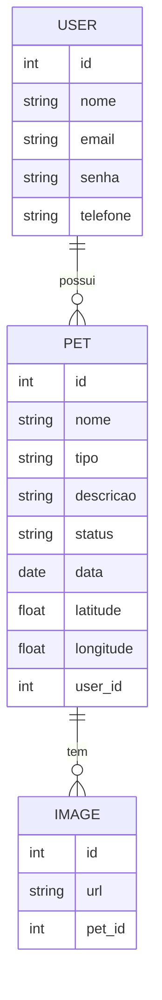
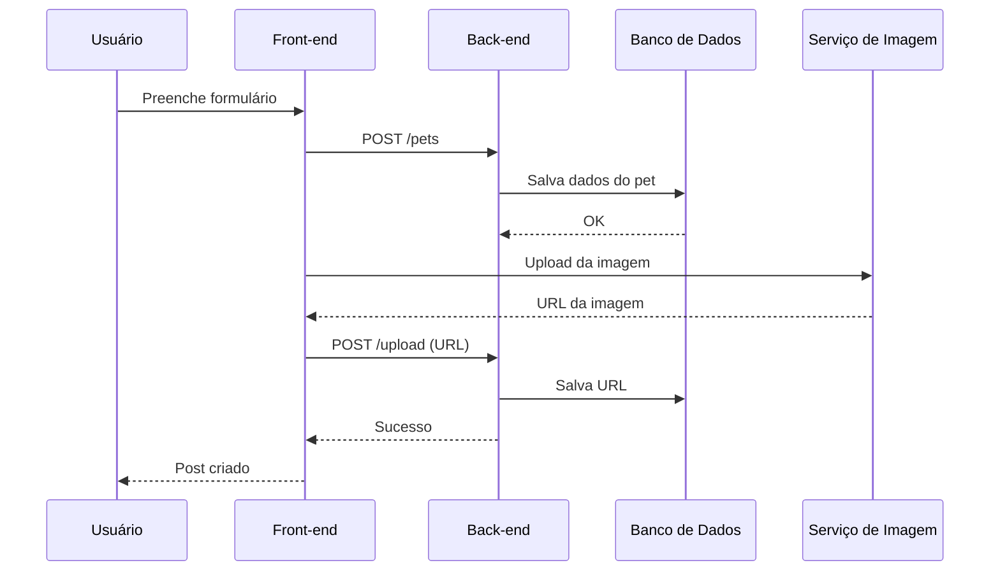

# Arquitetura



# Front-end
 
## Auth
- login(email, senha)
- register(dados)
- logout()
- getCurrentUser()
- JWT?
- contexto global (AuthContext)?

## Feed
- fetchPets(filtros)
- paginatePets(page)
- filterByLocation(lat, lng, radius)

## Postagem
- createPetPost(data)
- uploadImage(file)
- validateForm()

## Mapa
- loadMap()
- addMarkers(pets)
- getUserLocation()

## Perfil
- getUserPosts(userId)
- editUser()



# Back-end

## Camadas bem definidas
Routes → Controllers → Services → Repositories → Database


## Componentes
### Routes
Define endpoints, exemplo:

```python
@app.route("/pets", methods=["POST"])
def create_pet():
```

### Controllers
Responsável por:

- validar entrada
- chamar service
- retornar resposta

Exemplo:
```python
def create_pet_controller():
    data = request.json
    validate(data)
    pet = pet_service.create_pet(data)
    return jsonify(pet)
```
### Services (regra de negócio)
- create_pet(data)
- find_pets(filters)
- update_pet_status(id)
- associate_image(pet_id, url)

### Repositories (acesso ao banco)
- save_pet(pet)
- get_pet_by_id(id)
- list_pets()

### Auth Service
- generate_token(user)
- verify_token(token)
- hash_password()

### Integrações externas
- upload imagem
- mapas

# ER




# de Sequência (Criar Post)


